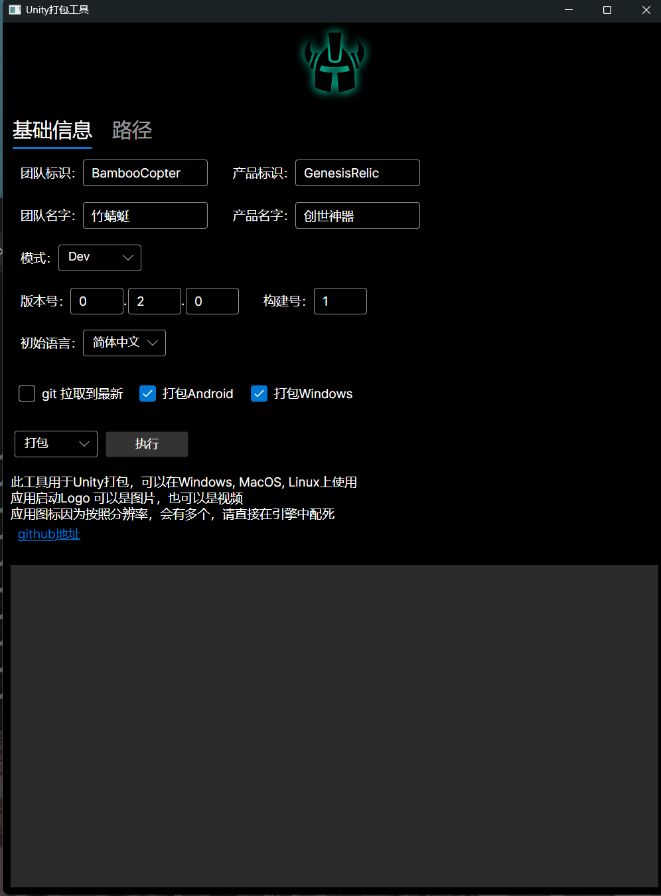
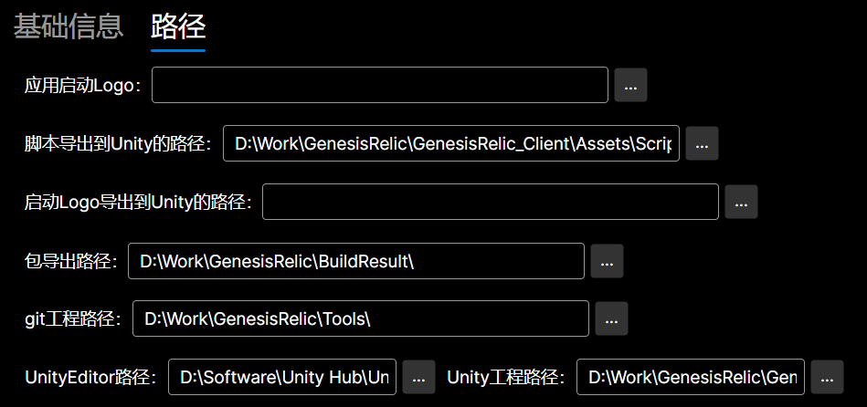

# 原理
	1. 底层逻辑是用得Unity的命令行，最终的打包逻辑在位于Unity工程中的一个静态方法（BuildScript.Run）
	2. 这个图形工具，最主要的功能就是把用户填写的打包信息，传递进BuildScript.Run，为后续的打包流程提供信息
	3. 信息传递，通过 Json完成，但是因为Json在传递中，因为执行命令行的缘故，字符串解析可能冲突，导致json信息损失。所以是转成 Base64 再传递的
	4. BuildScript 其实也是在工具写好的，然后工具会复制到Unity指定的路径，以便后续打包。这么做的目的，可以让整个打包流程（逻辑）都在工具中完成

# 特殊目录
	Data： 图形界面数据的持久化
	images：可以替换里面的图片，以替换Logo
	UnityBuilder: 这里就是Unity打包脚本，后续会CopyUnity指定的目录中
	UnityBuildToolSetUpScript.iss： 没错这个工具是通过 Inno Setup 来生成安装包的

# 界面

# 说明
	1. 因为是用了 Avalonia UI 开发的，除了Windows，也能生成 MacOS的安装包
	2. 图形界面，目前只支持Android和 Windows的打包选项，后续可能会扩展
	3. 这个工具是基于 .net9 环境开发的，需要安装对应的 sdk 才能启动该工具
[.net9 sdk page](https://dotnet.microsoft.com/en-us/download/dotnet/9.0).
